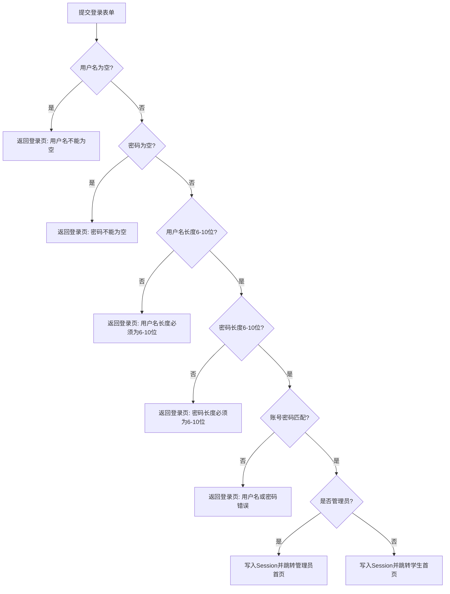

# 登录功能黑盒与白盒测试说明

## 1. 实验目的

- 掌握黑盒测试和白盒测试的基本方法。
- 掌握等价类划分方法，并用于登录输入校验测试。
- 使用白盒测试中的逻辑测试法设计登录功能测试用例，覆盖主要判断分支。

## 2. 被测功能说明

- 登录页面包含 `username`、`password` 两个输入框。
- 登录页面包含“登录”和“取消”两个按钮。
- 用户名和密码长度均为 6-10 位。
- 后端支持空值、长度非法、账号密码错误、登录成功等结果处理。
- 登录成功后，学生跳转 `/student/home`，管理员跳转 `/admin/home`。

## 3. 等价类划分表

| 输入条件 | 有效等价类 | 编号 | 无效等价类 | 编号 |
|---|---|---|---|---|
| 用户名 | 6-10位且存在 | U1 | 空 | U2 |
| 用户名 | 6-10位且存在 | U1 | 长度小于6 | U3 |
| 用户名 | 6-10位且存在 | U1 | 长度大于10 | U4 |
| 用户名 | 6-10位且存在 | U1 | 长度合法但用户不存在 | U5 |
| 密码 | 6-10位且正确 | P1 | 空 | P2 |
| 密码 | 6-10位且正确 | P1 | 长度小于6 | P3 |
| 密码 | 6-10位且正确 | P1 | 长度大于10 | P4 |
| 密码 | 6-10位且正确 | P1 | 长度合法但密码错误 | P5 |

## 4. 测试用例表

| 用例序号 | 输入数据 | 预期结果 | 运行结果 | 对应等价类 |
|---|---|---|---|---|
| TC01 | student001 / 123456 | 登录成功，跳转学生首页 | 通过 | U1, P1 |
| TC02 | admin01 / admin123 | 登录成功，跳转管理员首页 | 通过 | U1, P1 |
| TC03 | 空用户名 / 123456 | 提示用户名不能为空 | 通过 | U2, P1 |
| TC04 | student001 / 空密码 | 提示密码不能为空 | 通过 | U1, P2 |
| TC05 | abcde / 123456 | 提示用户名长度必须为6-10位 | 通过 | U3, P1 |
| TC06 | abcdefghijk / 123456 | 提示用户名长度必须为6-10位 | 通过 | U4, P1 |
| TC07 | student001 / 12345 | 提示密码长度必须为6-10位 | 通过 | U1, P3 |
| TC08 | student001 / 12345678901 | 提示密码长度必须为6-10位 | 通过 | U1, P4 |
| TC09 | user001 / 123456 | 提示用户名或密码错误 | 通过 | U5, P1 |
| TC10 | student001 / 654321 | 提示用户名或密码错误 | 通过 | U1, P5 |
| TC11 | user06 / 123456 | 用户名长度为6，进入账号密码校验并提示用户名或密码错误 | 通过 | U5, P1 |
| TC12 | student001 / 123456 | 用户名长度为10，登录成功，跳转学生首页 | 通过 | U1, P1 |
| TC13 | student001 / 123456 | 密码长度为6，登录成功，跳转学生首页 | 通过 | U1, P1 |
| TC14 | student001 / 1234567890 | 密码长度为10，进入账号密码校验并提示用户名或密码错误 | 通过 | U1, P5 |

页面结构测试覆盖：

- `GET /login` 返回 200。
- 页面包含 `name="username"` 和 `name="password"`。
- 页面包含“登录”和“取消”按钮。
- 页面包含 `minlength="6"` 和 `maxlength="10"`。

## 5. 白盒逻辑测试说明

登录逻辑按固定顺序判断：

1. 用户名 trim 后为空，返回登录页并提示“用户名不能为空”。
2. 密码 trim 后为空，返回登录页并提示“密码不能为空”。
3. 用户名长度不在 6-10 位，返回登录页并提示“用户名长度必须为6-10位”。
4. 密码长度不在 6-10 位，返回登录页并提示“密码长度必须为6-10位”。
5. 用户名或密码不匹配，返回登录页并提示“用户名或密码错误”。
6. 学生登录成功，写入 Session 并跳转 `/student/home`。
7. 管理员登录成功，写入 Session 并跳转 `/admin/home`。

上述 TC03-TC10 覆盖全部失败分支，TC01 和 TC02 覆盖学生、管理员两个成功分支，TC11-TC14 补充边界值路径。

