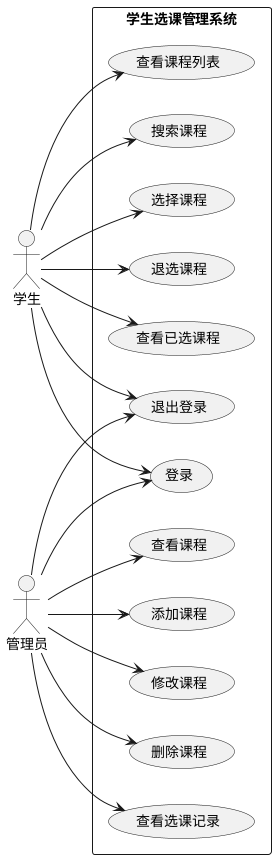
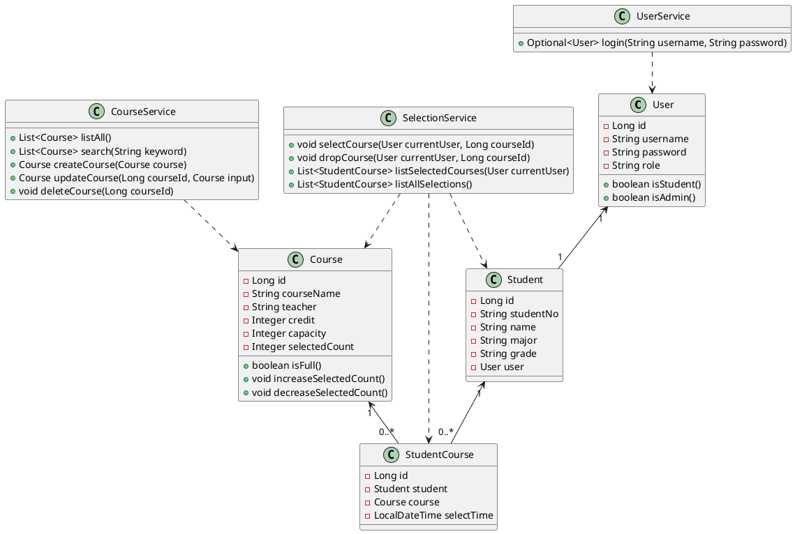
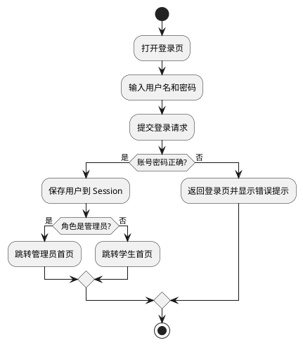
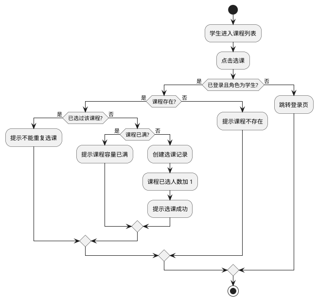
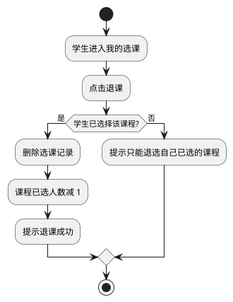
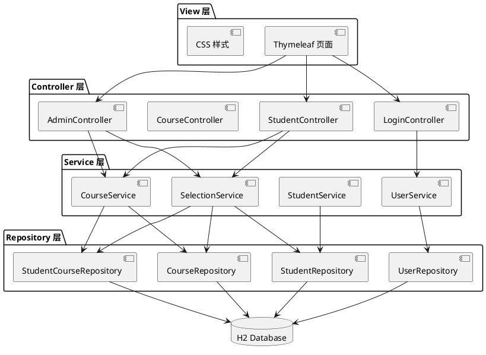

# UML 图 PlantUML 代码

## 用例图

```plantuml
@startuml
left to right direction
actor 学生 as Student
actor 管理员 as Admin

rectangle 学生选课管理系统 {
  Student --> (登录)
  Student --> (查看课程列表)
  Student --> (搜索课程)
  Student --> (选择课程)
  Student --> (退选课程)
  Student --> (查看已选课程)
  Student --> (退出登录)

  Admin --> (登录)
  Admin --> (查看课程)
  Admin --> (添加课程)
  Admin --> (修改课程)
  Admin --> (删除课程)
  Admin --> (查看选课记录)
  Admin --> (退出登录)
}
@enduml
```

## 类图

```plantuml
@startuml
class User {
  -Long id
  -String username
  -String password
  -String role
  +boolean isStudent()
  +boolean isAdmin()
}

class Student {
  -Long id
  -String studentNo
  -String name
  -String major
  -String grade
  -User user
}

class Course {
  -Long id
  -String courseName
  -String teacher
  -Integer credit
  -Integer capacity
  -Integer selectedCount
  +boolean isFull()
  +void increaseSelectedCount()
  +void decreaseSelectedCount()
}

class StudentCourse {
  -Long id
  -Student student
  -Course course
  -LocalDateTime selectTime
}

class UserService {
  +Optional<User> login(String username, String password)
}

class CourseService {
  +List<Course> listAll()
  +List<Course> search(String keyword)
  +Course createCourse(Course course)
  +Course updateCourse(Long courseId, Course input)
  +void deleteCourse(Long courseId)
}

class SelectionService {
  +void selectCourse(User currentUser, Long courseId)
  +void dropCourse(User currentUser, Long courseId)
  +List<StudentCourse> listSelectedCourses(User currentUser)
  +List<StudentCourse> listAllSelections()
}

User "1" <-- "1" Student
Student "1" <-- "0..*" StudentCourse
Course "1" <-- "0..*" StudentCourse
UserService ..> User
CourseService ..> Course
SelectionService ..> Student
SelectionService ..> Course
SelectionService ..> StudentCourse
@enduml
```

## 登录流程活动图

```plantuml
@startuml
start
:打开登录页;
:输入用户名和密码;
:提交登录请求;
if (账号密码正确?) then (是)
  :保存用户到 Session;
  if (角色是管理员?) then (是)
    :跳转管理员首页;
  else (否)
    :跳转学生首页;
  endif
else (否)
  :返回登录页并显示错误提示;
endif
stop
@enduml
```

## 学生选课流程活动图

```plantuml
@startuml
start
:学生进入课程列表;
:点击选课;
if (已登录且角色为学生?) then (是)
  if (课程存在?) then (是)
    if (已选过该课程?) then (是)
      :提示不能重复选课;
    else (否)
      if (课程已满?) then (是)
        :提示课程容量已满;
      else (否)
        :创建选课记录;
        :课程已选人数加 1;
        :提示选课成功;
      endif
    endif
  else (否)
    :提示课程不存在;
  endif
else (否)
  :跳转登录页;
endif
stop
@enduml
```

## 退课流程活动图

```plantuml
@startuml
start
:学生进入我的选课;
:点击退课;
if (学生已选择该课程?) then (是)
  :删除选课记录;
  :课程已选人数减 1;
  :提示退课成功;
else (否)
  :提示只能退选自己已选的课程;
endif
stop
@enduml
```

## 系统分层架构图

```plantuml
@startuml
package "View 层" {
  [Thymeleaf 页面]
  [CSS 样式]
}

package "Controller 层" {
  [LoginController]
  [StudentController]
  [CourseController]
  [AdminController]
}

package "Service 层" {
  [UserService]
  [StudentService]
  [CourseService]
  [SelectionService]
}

package "Repository 层" {
  [UserRepository]
  [StudentRepository]
  [CourseRepository]
  [StudentCourseRepository]
}

database "H2 Database" as H2

[Thymeleaf 页面] --> [LoginController]
[Thymeleaf 页面] --> [StudentController]
[Thymeleaf 页面] --> [AdminController]
[LoginController] --> [UserService]
[StudentController] --> [CourseService]
[StudentController] --> [SelectionService]
[AdminController] --> [CourseService]
[AdminController] --> [SelectionService]
[UserService] --> [UserRepository]
[StudentService] --> [StudentRepository]
[CourseService] --> [CourseRepository]
[CourseService] --> [StudentCourseRepository]
[SelectionService] --> [StudentRepository]
[SelectionService] --> [CourseRepository]
[SelectionService] --> [StudentCourseRepository]
[UserRepository] --> H2
[StudentRepository] --> H2
[CourseRepository] --> H2
[StudentCourseRepository] --> H2
@enduml
```
